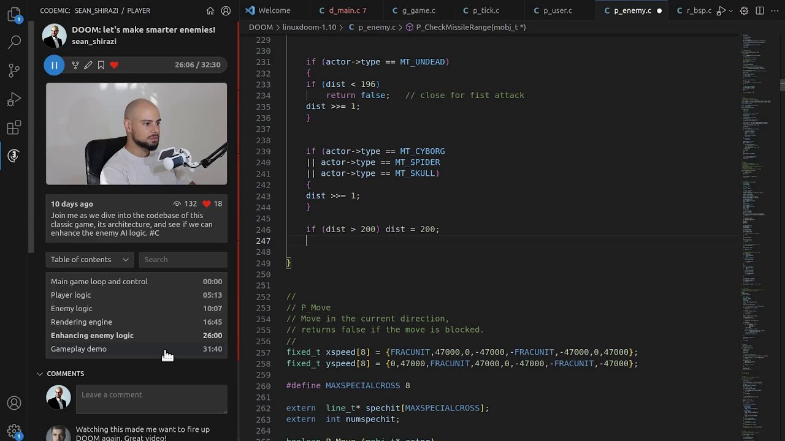

# CodeMic

CodeMic is a Visual Studio Code extension that enables developers to create interactive, guided tours within codebases. It records and replays code changes, including edits, selections, and scrolls, synchronized with optional audio and video narration. This tool is ideal for tutorials, codebase onboarding, and sharing development workflows.

## Features

- **Interactive Code Tours**: Record and replay code edits, selections, and navigation within VS Code.
- **Multimedia Integration**: Sync recordings with audio and video for comprehensive explanations.
- **Flexible Sharing**: Share on [CodeMic.io](https://CodeMic.io) or export recordings for embedding in documentation or sharing online.
- **Cross-Platform Support**: Plans to extend support to other IDEs like Emacs, (Neo)Vim, IntelliJ, Sublime Text, and Helix.

## Installation

Install from [Visual Studio Code Marketplace](https://marketplace.visualstudio.com/items?itemName=ComputingDen.codemic).

## License

This project is licensed under the MIT License. See the [LICENSE](LICENSE) file for details. 
